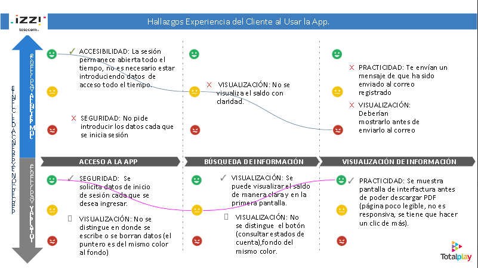

# Totalplay

##HEURISTICAS

Se realizaron diferentes análisis heurísticos de diversos materiales como lo eran la página  web y la aplicación

##EXPERIENCE MAP
Se analizaron las diversas experiencias que tenían los usuarios al usar los servicios de Totalplay y e plasmaron en mapas

##JOURNEY MAP
Los journey maps se realizaban a través de evaluar como el usuario realizaba diversas tareas

##BECHMARKING
Dependiendo de lo que se necesitara analizar se realizaba el benchmarking contra las principales competencias; en este caso Izzi y Axtel.

##USER PERSON Y MAPA DE CONTENIDO
En base a análisis previos otorgados por parte de un proveedor y organizando toda esa información se pudo generar un perfil de usuario que se adecuara a las necesidades del proyecto de realización de mapas de contenido. Esto para ayudar a conocer que tipo de envíos se debían realizar a ese perfil y no saturar al usuario con información todos los días, esta investigación se realizo con el poyo y entrevistas a diversas áreas involucradas en el envío de información para el usuario.

##APP NEGOCIOS
El equipo de CX tuvimos un acercamiento con el área correspondiente para realizar una propuesta de app ,al analizar sus requerimientos comenzamos a trabajar en la estrategia parala realización de dicha app donde pudimos recopilar información que nos ayudó a generar; personas, journey maps, arquitectura de información, etc.

